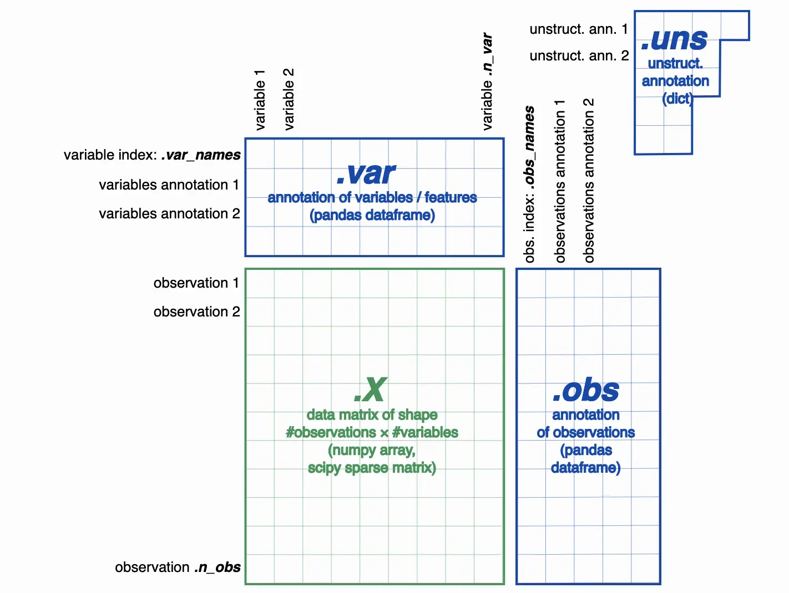
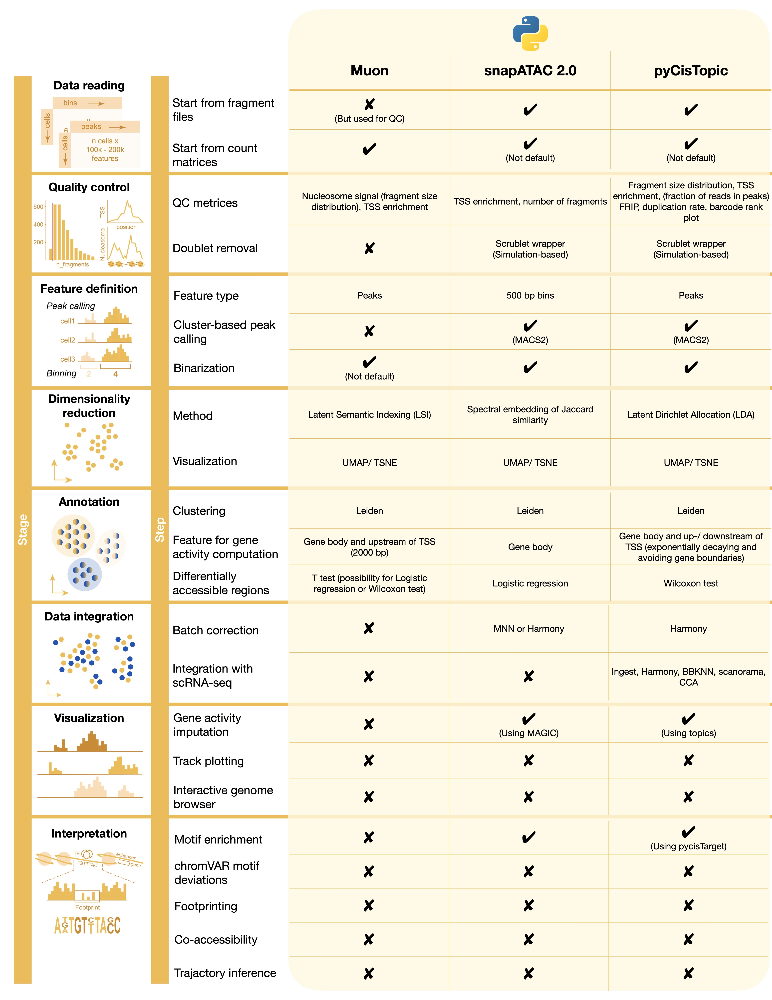

# Single-cell Multi-omics

[TOC]

## 1 scRNA-seq

Generating single-cell data from a biological sample requires multiple steps. Typical workflows incorporate single-cell dissociation, single-cell isolation, library construction, and sequencing.

**Single-cell dissociation**

> As a first step, a single suspension is generated in a process called *single-cell dissociation* which the tissue is digested.

**Single-cell isolation**

> To profile the mRNA in each cell separately, cells must be isolated. In this process, errors can occur that lead to multiple cells being captured together (**doublets or multiplets**), non-viable cells being captured, or no cell being captured at all (empty droplets/wells).

**Library construction**

> Library construction is the process in which the intracellular mRNA is captured, reverse-transcribed to cDNA molecules, and amplified.

**Sequencing**

> Sequencing produces **read data**, which undergo quality control, grouping based on their assigned barcodes, and alignment in read processing pipelines. For UMI-based protocols, read data can be further demultiplexed to produce counts of captured mRNA molecules (**count data**).

scRNA-seq measures transcriptomic activities from RNA abundance, informing cell identity, stage, and functionality. 

Single-cell RNA sequencing (scRNA-seq) is a popular and powerful technology that allows you to **profile the whole transcriptome of a large number of individual cells.**

A central component of scRNA-seq analysis is the expression matrix, which represents the number of transcripts observed for each gene and cell.
The workflow can be split into two main sections: 1) generation of the expression matrix and 2) analyses of the expression matrix.

### 1.1 Quality control

Before analyzing the single-cell gene expression data, we must ensure that cellular barcode data correspond to viable cells. 

Cell QC is commonly performed based on the following three QC covariates:

1. The number of counts per barcode (count depth)
2. The number of genes per barcode
3. The fraction of counts from mitochondrial genes per barcode

**QC is to examine the distributions of these QC covariates for outlier peaks that are filtered out by thresholding.** These outlier barcodes can correspond to dying cells, cells whose membranes are broken, or doublets (which means cell barcodes correspond to more than one cell).

**The steps to perform QC are as follows:**

1. Filtering low-quality reads
2. Correction of ambient RNA
3. Doublet Detection

#### 1.1.1 Filtering low-quality reads

QC on only a few or small datasets is often performed in a manual fashion by looking at the distribution of different QC covariates and identifying outliers which will be filtered afterward. However, as datasets grow in size this task is becoming more and more time-consuming and it might be worth considering **automatic thresholding** via MAD (median absolute deviations).
$$
MAD=median(|X_i - median(X)|)
$$
$X_i$ is the respective QC metric of an observation. MAD describes a robust statistic of the variability of the metric.

In QC, the first step is to **calculate the QC covariates or metrics**.

#### 1.1.2 Correction of ambient RNA

For droplet-based single-cell RNA-seq experiments, a certain amount of background mRNA is present in the dilution that gets distributed into the droplets with cells and sequenced along with them. The net effect of this is to produce background contamination that represents expression not from the cell contained within a droplet but the solution that contained the cells.

Cell-free mRNA molecules, also known as ambient RNA, can confound the number of observed counts and can be seen as background contamination. It is important to correct droplet-based scRNA-seq datasets for cell-free mRNA as it may distort the interpretation of the data in our downstream analysis.

#### 1.1.3 Doublet Detection

Doublets are defined as two cells that are sequenced under the same cellular barcode. For example, if they were captured in the same droplet. A doublet is called **homotypic** if it is formed by the same cell type (but from different individuals) and **heterotypic** otherwise.

Homotypic doublets are not necessarily identifiable from count matrices and are often considered innocuous as they can be identified with cell hashing or SNPs. Hence, their identification is not the main goal of the doublet detection methods.

Doublets formed from different cell types or states are called heterotypic. **Their identification is crucial as they are most likely misclassified and can lead to distorted downstream analysis steps.**

#### 1.1.4 Key Takeaways

1. Filtering of poor-quality cells should be based on median absolute deviations with lenient cutoffs to avoid bias against smaller subpopulations.
2. Feature-based filtering does not show benefits for downstream tasks.
3. Doublets can be efficiently detected with tools like scDblFinder.
4. Doublet detection methods should not be run on aggregated scRNA-seq data representing multiple batches.

### 1.2 Normalization

The number of useful reads obtained from a sequencing experiment will vary between cells, and we must correct for this difference. For scRNA-seq data, this effect is pronounced, as the amount of RNA per cell can vary significantly owing to cell cycle stage and other biological factors, even within the same cell type. Technical factors might further increase the variability in sequencing depth. **Differences owing to uneven sequencing depth can be ameliorated by normalization.**

The preprocessing step of “normalization” aims to adjust the raw counts in the dataset for variable sampling effects by scaling the observable variance to a specified range.

### 1.3 Data correction and integration

Normalized data may still contain unwanted variability. Data correction targets further technical and biological covariates such as batch, dropout, or cell cycle effection. These covariates are not always corrected. Instead, the decision of which covariates to consider will depend on the intended downstream analysis.

#### 1.3.1 Cell cycle assignment

While correcting for technical covariates may be crucial to uncovering the underlying biological signal, correction for biological covariates serves to single out particular biological signals of interest.

The most common biological data correction is to remove the effects of the cell cycle on the transcriptome. This data correction can be performed by a simple linear regression against a cell cycle score as implemented in the Scanpy and Seurat platforms or in specialized packages with more complex mixture models such scLVM or fscLVM.

#### 1.3.2 Count effect correction

The most prominent technical covariates in single-cell data are **count depth and batch.** Although normalization scales count data to render gene counts comparable between cells, a count depth effect often remains in data. This count depth effect can be both a biological and a technical artifact.

Technical count effects may remain after normalization as no scaling method can infer the expression values of genes that were not detected due to poor sampling.

An alternative to regression-based strategies for removing count effects is to **use a more rigorous normalization procedure** such as downsampling or non-linear normalization methods. These approaches may be particularly relevant for plate-based scRNA-seq datasets where the larger variation of count depths per cell can mask the heterogeneity between cells.

#### 1.3.3 Batch effect correction

Similar to differences in sequencing depth (count depth), batch effects are technical confounders that must be accounted for in order for the true biological signal to emerge. Batch effects are a common problem in biology, and they arise from differences in non-biological factors such as the time of experiment, the person carrying out the experiment, or differences in reagents. If not properly accounted for, batch effects can be mistaken for true biological signals, but, through careful experimental design, they can be avoided altogether.

Batch effects can occur when cells are handled in distinct groups. 

#### 1.3.4 Imputation and smoothing (Expression recovery)

Many normalization strategies do not change the zeros, so it is tempting to assume that they represent missing values and to fill in an estimate derived mathematically from the detected transcripts.

### 1.4 Feature selection

A human single-cell RNA-seq dataset can contain expression values for up to 25,000 genes. Many of these genes will not be informative for a given scRNA-seq dataset, and many genes will mostly contain zero counts. Even after filtering out these zero-count genes in the QC step, the feature space for a single-cell dataset can have over 15,000 dimensions. 

**To ease the computational burden on downstream analysis tools, reduce the noise in the data, and to visualize the data, we can use several approaches to reduce the dimensionality of the dataset.**

The first step of reducing the dimensionality of scRNA-seq datasets commonly is feature selection. In this step, the dataset is filtered to keep only genes that are "informative" of the variability in data. Thus, **highly variable genes (HVGs) are often used**.

### 1.5 Dimensionality reduction

After feature selection, the dimensions of single-cell expression matrices can be further reduced by dedicated dimensionality reduction algorithms. **These algorithms embed the expression matrix into a low-dimensional space, which is designed to capture the underlying structure in the data in as few dimensions as possible.** 

This approach works as single-cell RNA-seq data are inherently low-dimensional. In other words, the biological manifold on which cellular expression profiles lie can be sufficiently described by far fewer dimensions than the number of genes. Dimensionality reduction aims to find these dimensions.

> There are two main objectives of dimensionality reduction methods: **visualization and summarization.**

**Visualization**

> Visualization is the attempt to optimally describe the dataset in two or three dimensions. These reduced dimensions are used as coordinates on a scatter plot to obtain a visual representation of the data.

**Summarization**

> Summarization does not prescribe the number of output components. Instead, higher components become less important for describing the variability present in the data. Summarization techniques can be used to reduce the data to its essential components by finding the inherent dimensionality of the data, and are thus helpful for downstream analysis.

#### 1.5.1 Dimensionality reduction technique

Two popular dimensionality reduction techniques that are principally summarization methods are **principal component analysis (PCA) and diffusion maps**.

**Principal component analysis (PCA)**

**Diffusion maps**

### 1.6 Visualization

For visualization purposes, it is standard practice to use non-linear dimensionality reduction methods.

### 1.7 Single-cell analysis practices

**AnnData**

Scanpy is based on `AnnData`, which provides the `AnnData` class.

## 2 scATAC-seq

Single-cell sequencing assay for transposase-accessible chromatin (scATAC-seq) is a state-of-the-art technology for analyzing genome-wide regulatory landscapes in single cells. Single-cell ATAC-seq data are sparse and noisy, and analyzing such data is challenging.

Chromatin accessibility largely reflects the combined regulatory state of a cell, serving as an orthogonal layer of information to mRNA levels describing cell identity. **Exploring the chromatin accessibility profile enables additional insights into gene regulatory mechanisms and cell differentiation processes** that might not be captured by scRNA-seq data.

Single-cell ATAC-seq data measures chromatin accessibility across the entire genome. Since this includes coding and non-coding regions, genes can not be used as pre-defined features, as is the case for scRNA-seq data.

### 2.1  Quality control

A crucial part of every single-cell analysis is the removal of low-quality cells which can distort downstream analysis outcomes. scATAC-seq data, having only 1-10% of open chromatin regions detected in each cell, is even more sparse than scRNA-seq data. Therefore, quality issues such as low sequencing depth per cell or poor signal-to-noise ratio can lead to uninformative observations (cells). Another challenge is the detection of multiplets (two or more cells profiled together).

## 3 Downstream analysis

After pre-processing, methods that we call downstream analysis are used to extract biological insights and describe the underlying biological system. These descriptions are obtained by fitting interpretable models to the data.

Downstream analysis can be divided into cell- and gene-level approaches. 

Cell-level analysis typically focuses on describing two structures: clusters and trajectories.

- cluster analysis methods attempt to explain the heterogeneity in the data based on a categorization of cells into groups.
- in trajectory analysis, the data are regarded as a snapshot of a dynamic process. Trajectory analysis methods investigate this underlying process.

> These structures can in turn be analysed on the cell and the gene level leading to cluster analysis and trajectory analysis methods.

### 3.1 Cluster analysis

#### 3.1.1 Clustering

Clusters allow us to infer the identity of member cells. Clusters can obtained by grouping cells based on the similarity of their gene expression profiles. Expression profile similarity is determined via **distance metrics, which 0ften take dimensionality-reduced representations as input.**

Two approaches exist to generate cell clusters from these similarity scores: **clustering algorithms and community detection methods.**

Clustering is a classical unsupervised machine learning problem, based directly on a distance matrix.

Community detection methods are graph-partitioning algorithms and thus rely on a graph representation of single-cell data. This graph representation is obtained using a K-Nearest Neighbour approach (KNN graph). Cells are represented as nodes in the graph. Each cell is connected to its K most similar cells, which are typically obtained using Euclidean distances on the PC-reduced expression space.

#### 3.1.2 Cluster annotation

## 4 Joint modality single-cell dataset

### Background

**The problem that needs to be solved is as follows:**

For joint profiling datasets with extreme data sparsity and random noise in either omic of the dataset, the inconsistency of multi-omics joint embedding will largely confuse the biological variation in cell latent embedding and exceedingly smooth the generated data from continuous distribution of generative model, impeding the explanation and downstream application of joint latent embedding.

**The idea to resolve this problem has been derived from here:**

Self-attention-based embedding models, such as Transformer and BERT, show high performance on extreme sparse NLP tasks and sequence or structured tasks like protein-structured prediction, indicating their potential in capturing the weak correlation from high-dimensional high-sparsity biological data.

### The scMVP model

The scMVP model integrated scRNA and scATAC data into a common low-dimensional latent space for cell embedding, clustering, and imputation.

The basic idea of scMVP is to introduce a **Gaussian mixture model (GMM) prior** to derive the common latent embedding by maximizing the likelihood of the joint generation probability of the muti-omic data, which is implemented as a multi-model asymmetric MM-VAE model with two extra clustering consistency modules to align each imputed omics and preserve the common semantic information, and used to impute missing data cluster cell groups, assemble multiple modalities, and construct a developmental lineage.

First, scMVP takes the raw count of scRNA-seq and term frequency-inverse document frequency (TF-IDF) transformed scATAC-seq as input. To auto-learn a common latent distribution of the joint scRNA-seq and scATAC-seq profiling, scMVP utilizes GMM as the prior distribution of latent embedding $z$ for the muti-view VAE model, that is the observed scRNA gene expression $x$ and TF-IDF transformed scATAC chromatin accessibility $y$ in each modeled as a sample drawn from a negative binomial (NB) distribution $p(x|z,c)$ and a zero-inflated Poisson (ZIP) distribution $p(y|z,c)$, conditioned on the common latent embedding $z$ and cell type $c$, one of predefined K components of GMM.

scMVP uses a two-channel Decoder neural network transforming the common latent embedding $z$ into the parameters of NB and ZIP distribution, with a cell type $c$ guided attention module to capture the potential correlation between the scRNA and scATAC data within the same cell. Then, the generated scRNA and scATAC data are denoised the imputed by the mean of the corresponding output distribution, respectively, while the embedded common latent code $z$ can be used for a series of downstream analyses.

