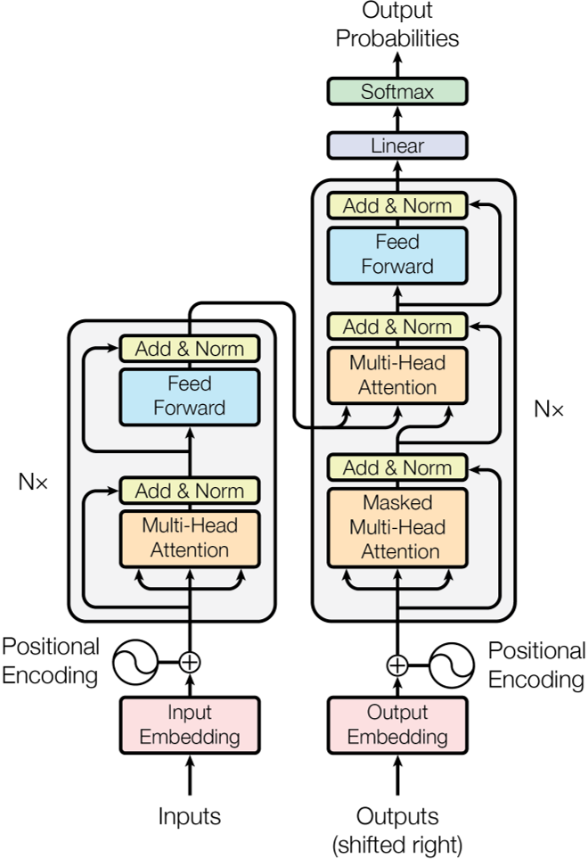
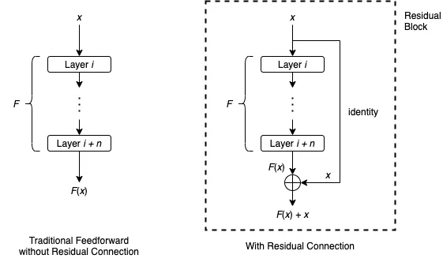
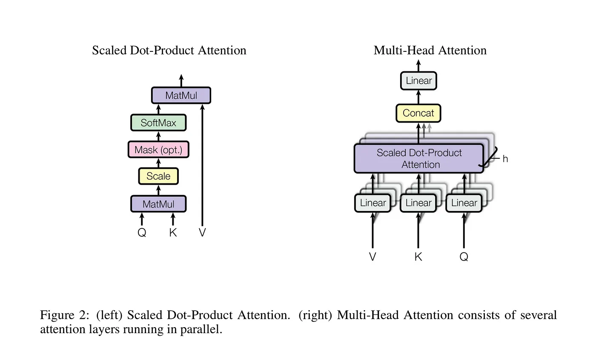
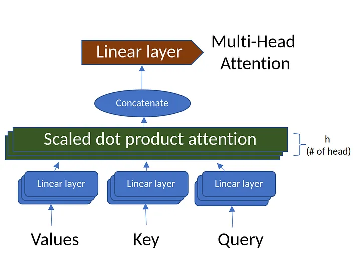

# Try to implement a model for multi-view profiling of single-cell RNA-seq and ATAC-seq data

[TOC]

<div style="page-break-after:always;"></div>

##  1 Joint modality single-cell dataset

### 1.1 Background

**The problem that needs to be solved is as follows:**

For joint profiling datasets with extreme data sparsity and random noise in either omic of the dataset, the inconsistency of multi-omics joint embedding will largely confuse the biological variation in cell latent embedding and exceedingly smooth the generated data from continuous distribution of generative model, impeding the explanation and downstream application of joint latent embedding.

**The idea to resolve this problem has been derived from here:**

Self-attention-based embedding models, such as Transformer and BERT, show high performance on extreme sparse NLP tasks and sequence or structured tasks like protein-structured prediction, indicating their potential in capturing the weak correlation from high-dimensional high-sparsity biological data.

### 1.2 The scMVP model

The scMVP model integrated scRNA and scATAC data into a common low-dimensional latent space for cell embedding, clustering, and imputation.

The basic idea of scMVP is to introduce a **Gaussian mixture model (GMM) prior** to derive the common latent embedding by maximizing the likelihood of the joint generation probability of the muti-omic data, which is implemented as a multi-model asymmetric MM-VAE model with two extra clustering consistency modules to align each imputed omics and preserve the common semantic information, and used to impute missing data cluster cell groups, assemble multiple modalities, and construct a developmental lineage.

First, scMVP takes the raw count of scRNA-seq and term frequency-inverse document frequency (TF-IDF) transformed scATAC-seq as input. To auto-learn a common latent distribution of the joint scRNA-seq and scATAC-seq profiling, scMVP utilizes GMM as the prior distribution of latent embedding $z$ for the muti-view VAE model, that is the observed scRNA gene expression $x$ and TF-IDF transformed scATAC chromatin accessibility $y$ in each modeled as a sample drawn from a negative binomial (NB) distribution $p(x|z,c)$ and a zero-inflated Poisson (ZIP) distribution $p(y|z,c)$, conditioned on the common latent embedding $z$ and cell type $c$, one of predefined K components of GMM.

scMVP uses a two-channel Decoder neural network transforming the common latent embedding $z$ into the parameters of NB and ZIP distribution, with a cell type $c$ guided attention module to capture the potential correlation between the scRNA and scATAC data within the same cell. Then, the generated scRNA and scATAC data are denoised the imputed by the mean of the corresponding output distribution, respectively, while the embedded common latent code $z$ can be used for a series of downstream analyses.

### 1.3 Methods

1. For joint profiles of scRNA-seq and scATAC-seq data, the expression profiles of RNA and TF-IDF transformed ATAC, which converts original binary peaks into continuous value by weighting each peak with its occurring frequency, are represented as gene expression vector $x_i \in R^{|G|}$ and ATAC peak vector $y_i \in R^{|P|}, i=1,2,..., N$, where G is the number of all detected genes, $P$ is the corresponding number of detected peaks, and $N$ is the total number of cells.

   > - the expression of RNA: gene expression vector $x_i$
   >
   > - the expression of TF-IDF transformed ATAC: ATAC peak vector $y_i$

2. A multi-view generative model is built to recover the scRNA profile $x_i$ and scATAC profile $y_i$ from a common latent embedding $z_i \in R^D$ (the dimension $D$ $\ll$ min($|G|$, $|P|$)), where

   > - the latent code $z_i$ follows a GMM-based prior distribution
   >
   > - $x_i$ and $y_i$ each follow a negative binomial (NB) distribution and zero-inflated Poisson distribution.
   >
   > - The Poisson distribution is better to fit the signal counts of TF-IDF transformed scATAC chromatin accessibility rather than the regular binary transformation. 
   >
   > - Due to the extreme sparity of scATAC dataset, we use zero-inflated Poisson for scATAC peaks in current joint sequencing technique.

3. The $Decoder_y(z)$ is designed as a self-attention-based transformer subnetwork to capture weak and genome-wide correlation from sparse and high-dimensional ($>10^5$) scATAC data, that is:

$$
\begin{aligned}
Decoder_y(z)= & LayerNorm(BatchNorm(M L P(z)) \\
& +\operatorname{MultiHead}(\mathrm{Q}(BatchNorm(MLP(z))), \operatorname{K}(BatchNorm(M L P(z))), \\
& \mathrm{V}(BatchNorm(M L P(z)))) * \operatorname{Softmax}(M L P(p(z \mid c)))
\end{aligned}
$$

$$
MultiHead(Q,K,V)=Concat(head_1,...,head_n)W^O
$$

$$
\begin{equation}
	\begin{aligned}
		head_i &= Attention(QW_i^Q,KW^K_i,VW^V_i) \\
			&= softmax(\frac{(QW_i^Q)(KW_i^K)}{\sqrt{d_K}})VW_i^V
	\end{aligned}
\end{equation}
$$

3. As shown in the formula above, the $Decoder_y(z)$ is cascaded by a multilayer perceptron (MLP), a batch normalization, a multi-head self-attention-guided skip connection module (similar to the Resnet block) and a layer normalization, which is then weighted by $Softmax(MLP(p(z| c)))$, functioned as the additional cell cluster-indicated attention module to recover the cell-type specific semantic information.

4. The RNA generating/decoder subnetwork $Decoder_x(z)$ utilizes a canonical mask attention structure by cascading a multilayer perceptron, a layer normalization, a batch normalization, and an attention module, which can be presented as follows:

$$
Decoder_x(z)=MLP(BatchNorm(LayerNorm(MLP(z))))*Softmax(MLP(z))
$$


## 2 Transformer

### 2.1 Model Architecture



### 2.2 [Residual connection](https://towardsdatascience.com/what-is-residual-connection-efb07cab0d55)

[reference]()

One of the dilemmas of training neural networks is that we usually want deeper neural networks for better accuracy and performance. However, the deeper the network, the harder it is for the training to converge. Residual connection (also known as skip connection) is a simple yet very effective technique to make training deep neural networks easier. It is widely adopted by different models, from ResNet in computer vision where it was first introduced, Transformer in natural language processing, all the way to AlphaZero in reinforcement learning and AlphaFold for protein structure predictions.

#### 2.2.1 The Formula

In the traditional feedforward neural networks, data flows through each layer sequentially: the output of a layer is the input for the next layer.

Residual connection provides another path for data to reach the latter parts of the neural network by skipping some layers. Consider a sequence of layers, layer $i$ to layer $i + n$, and let $F$ be the function represented by these layers. Denote the input for layer $i$ by $x$. In the traditional feedforward setting, $x$ will simply go through these layers one by one, and the outcome of layer $i+n$ is $F(x)$. A residual connection that bypasses these layers typically works as follows:



The residual connection first applies identity mapping to $x$, then it performs element-wise addition $F(x)+x$. In literature, the whole architecture that takes an input $x$ and produces output $F(x)+x$ is usually called a residual block or a building block. Quite often, a residual block will also include an activation function such as ReLU applied to $F(x)+x$.

The main reason for emphasizing the seemingly superfluous identity mapping in the figure above is that it serves as a placeholder for more complicated functions if needed. For example, the element-wise addition $F(x)+x$ makes sense only if $F(x)$ and $x$ have the same dimensions. If their dimensions are different, we can replace the identity mapping with a linear transformation (i.e. multiplication by a matrix $W$), and perform $F(x)+Wx$ instead.

In general, multiple residual blocks, which may be of the same or different architectures, are used within the whole neural network.

#### 2.2.2 How does it help train deep neural networks?

For feedforward neural networks, training a deep network is usually very difficult, due to problems such as exploding gradients and vanishing gradients. On the other hand, the training process of a neural network with residual connections is empirically shown to converge much more easily, even if the network has several hundred layers. Like many techniques in deep learning, we still do not fully understand all the details about the residual connection. However, we do have some interesting theories that are supported by strong experimental results.

### 2.3 Attention



#### 2.3.1 Scaled Dot-Product Attention

$$
Attention(Q,K,V)=softmax(\frac{QK^T}{\sqrt{d_k}})V
$$

The two most commonly used attention functions are **additive attention** and **dot-product (multiplicative) attention**. Dot-product attention is identical to the formula above, except for the scaling factor of $\frac{1}{\sqrt{d_k}}$. Additive attention computes the compatibility function using a feed-forward network with a single hidden layer. While the two are similar in theoretical complexity, dot-product attention is much faster and more space-efficient in practice, since it can be implemented using highly optimized matrix multiplication code.

While for small values of $d_k$ the two mechanisms perform similarly, additive attention outperforms dot product attention without scaling for larger values of $d_k$. We suspect that for large values of $d_k$, the dot products grow large in magnitude, pushing the softmax function into regions where it has extremely small gradients. To counteract this effect, we scale the dot products by $\frac{1}{\sqrt{d_k}}$.

#### 2.3.2 Multi-Head Attention



Instead of performing a single attention function with $d_{model}$-dimensional keys, values, and queries, we found it beneficial to linearly project the queries, keys and values $h$ times with different, learned linear projections to $d_k$, $d_k$ and $d_v$ dimensions, respectively.

Multi-head attention allows the model to jointly attend to information from different representation subspaces at different positions. With a single attention head, averaging inhibits this.
$$
\begin{aligned}
\operatorname{MultiHead}(Q, K, V) & =\operatorname{Concat}\left(\operatorname{head}_1, \ldots, \operatorname{head}_{\mathrm{h}}\right) W^O \\
\text { where head } & =\operatorname{Attention}\left(Q W_i^Q, K W_i^K, V W_i^V\right)
\end{aligned}
$$
Where the projections are parameter matrices $W_i^Q\in \mathbb{R}^{d_{model}\times d_k}$, $W_i^K\in \mathbb{R}^{d_{model}\times d_k}$, $W_i^V\in \mathbb{R}^{d_{model}\times d_v}$ and $W^O\in \mathbb{R}^{hd_{v}\times d_{model}}$.

### 2.4 Positional Encoding

Since the Transformer model contains no recurrence and no convolution, in order for the model to make use of the order of the sequence, we must inject some information about the relative or absolute position of the tokens in the sequence.

To this end, we add "positional encodings" to the input embeddings at the bottoms of the encoder and decoder stacks. The positional encodings have the same dimension model as the embeddings so that the two can be summed. There are many choices of positional encodings, learned and fixed.
$$
\begin{aligned}
P E_{(p o s, 2 i)} & =\sin \left(p o s / 10000^{2 i / d_{\text {model }}}\right) \\
P E_{(p o s, 2 i+1)} & =\cos \left(p o s / 10000^{2 i / d_{\text {model }}}\right)
\end{aligned}
$$

### 2.5 Building the Transformer Model with PyTorch

To build the Transformer model the following steps are necessary:

1. Importing the libraries and modules
2. Defining the basic building blocks: Multi-head Attention, Position-wise Feed-Forward Networks, Positional Encoding

3. Building the Encoder block
4. Building the Decoder block
5. Combining the Encoder and Decoder layers to create the complete Transformer network
6. Prepare sample data
7. Train the model

```python3
import torch
import torch.nn as nn
import torch.optim as optim
import torch.utils.data as data
import math
import copy


class MultiHeadAttention(nn.Module):
    def __init__(self, d_model, num_heads):
        super(MultiHeadAttention, self).__init__()
        # Ensure that the model dimension (d_model) is divisible by the number of heads
        assert d_model % num_heads == 0, "d_model must be divisible by num_heads"
        
        # Initialize dimensions
        self.d_model = d_model # Model's dimension
        self.num_heads = num_heads # Number of attention heads
        self.d_k = d_model // num_heads # Dimension of each head's key, query, and value
        
        # Linear layers for transforming inputs
        self.W_q = nn.Linear(d_model, d_model) # Query transformation
        self.W_k = nn.Linear(d_model, d_model) # Key transformation
        self.W_v = nn.Linear(d_model, d_model) # Value transformation
        self.W_o = nn.Linear(d_model, d_model) # Output transformation
        
    def scaled_dot_product_attention(self, Q, K, V, mask=None):
        # Calculate attention scores
        attn_scores = torch.matmul(Q, K.transpose(-2, -1)) / math.sqrt(self.d_k)
        
        # Apply mask if provided (useful for preventing attention to certain parts like padding)
        if mask is not None:
            attn_scores = attn_scores.masked_fill(mask == 0, -1e9)
        
        # Softmax is applied to obtain attention probabilities
        attn_probs = torch.softmax(attn_scores, dim=-1)
        
        # Multiply by values to obtain the final output
        output = torch.matmul(attn_probs, V)
        return output
        
    def split_heads(self, x):
        # Reshape the input to have num_heads for multi-head attention
        batch_size, seq_length, d_model = x.size()
        return x.view(batch_size, seq_length, self.num_heads, self.d_k).transpose(1, 2)
        
    def combine_heads(self, x):
        # Combine the multiple heads back to original shape
        batch_size, _, seq_length, d_k = x.size()
        return x.transpose(1, 2).contiguous().view(batch_size, seq_length, self.d_model)
        
    def forward(self, Q, K, V, mask=None):
        # Apply linear transformations and split heads
        Q = self.split_heads(self.W_q(Q))
        K = self.split_heads(self.W_k(K))
        V = self.split_heads(self.W_v(V))
        
        # Perform scaled dot-product attention
        attn_output = self.scaled_dot_product_attention(Q, K, V, mask)
        
        # Combine heads and apply output transformation
        output = self.W_o(self.combine_heads(attn_output))
        return output
    

class PositionWiseFeedForward(nn.Module):
    def __init__(self, d_model, d_ff):
        super(PositionWiseFeedForward, self).__init__()
        self.fc1 = nn.Linear(d_model, d_ff)
        self.fc2 = nn.Linear(d_ff, d_model)
        self.relu = nn.ReLU()

    def forward(self, x):
        return self.fc2(self.relu(self.fc1(x)))
    

class PositionalEncoding(nn.Module):
    def __init__(self, d_model, max_seq_length):
        super(PositionalEncoding, self).__init__()
        
        pe = torch.zeros(max_seq_length, d_model)
        position = torch.arange(0, max_seq_length, dtype=torch.float).unsqueeze(1)
        div_term = torch.exp(torch.arange(0, d_model, 2).float() * -(math.log(10000.0) / d_model))
        
        pe[:, 0::2] = torch.sin(position * div_term)
        pe[:, 1::2] = torch.cos(position * div_term)
        
        self.register_buffer('pe', pe.unsqueeze(0))
        
    def forward(self, x):
        return x + self.pe[:, :x.size(1)]
    

class EncoderLayer(nn.Module):
    def __init__(self, d_model, num_heads, d_ff, dropout):
        super(EncoderLayer, self).__init__()
        self.self_attn = MultiHeadAttention(d_model, num_heads)
        self.feed_forward = PositionWiseFeedForward(d_model, d_ff)
        self.norm1 = nn.LayerNorm(d_model)
        self.norm2 = nn.LayerNorm(d_model)
        self.dropout = nn.Dropout(dropout)
        
    def forward(self, x, mask):
        attn_output = self.self_attn(x, x, x, mask)
        x = self.norm1(x + self.dropout(attn_output))
        ff_output = self.feed_forward(x)
        x = self.norm2(x + self.dropout(ff_output))
        return x
    

class DecoderLayer(nn.Module):
    def __init__(self, d_model, num_heads, d_ff, dropout):
        super(DecoderLayer, self).__init__()
        self.self_attn = MultiHeadAttention(d_model, num_heads)
        self.cross_attn = MultiHeadAttention(d_model, num_heads)
        self.feed_forward = PositionWiseFeedForward(d_model, d_ff)
        self.norm1 = nn.LayerNorm(d_model)
        self.norm2 = nn.LayerNorm(d_model)
        self.norm3 = nn.LayerNorm(d_model)
        self.dropout = nn.Dropout(dropout)
        
    def forward(self, x, enc_output, src_mask, tgt_mask):
        attn_output = self.self_attn(x, x, x, tgt_mask)
        x = self.norm1(x + self.dropout(attn_output))
        attn_output = self.cross_attn(x, enc_output, enc_output, src_mask)
        x = self.norm2(x + self.dropout(attn_output))
        ff_output = self.feed_forward(x)
        x = self.norm3(x + self.dropout(ff_output))
        return x
    

class Transformer(nn.Module):
    def __init__(self, src_vocab_size, tgt_vocab_size, d_model, num_heads, num_layers, d_ff, max_seq_length, dropout):
        super(Transformer, self).__init__()
        self.encoder_embedding = nn.Embedding(src_vocab_size, d_model)
        self.decoder_embedding = nn.Embedding(tgt_vocab_size, d_model)
        self.positional_encoding = PositionalEncoding(d_model, max_seq_length)

        self.encoder_layers = nn.ModuleList([EncoderLayer(d_model, num_heads, d_ff, dropout) for _ in range(num_layers)])
        self.decoder_layers = nn.ModuleList([DecoderLayer(d_model, num_heads, d_ff, dropout) for _ in range(num_layers)])

        self.fc = nn.Linear(d_model, tgt_vocab_size)
        self.dropout = nn.Dropout(dropout)

    def generate_mask(self, src, tgt):
        src_mask = (src != 0).unsqueeze(1).unsqueeze(2)
        tgt_mask = (tgt != 0).unsqueeze(1).unsqueeze(3)
        seq_length = tgt.size(1)
        nopeak_mask = (1 - torch.triu(torch.ones(1, seq_length, seq_length), diagonal=1)).bool()
        tgt_mask = tgt_mask & nopeak_mask
        return src_mask, tgt_mask

    def forward(self, src, tgt):
        src_mask, tgt_mask = self.generate_mask(src, tgt)
        src_embedded = self.dropout(self.positional_encoding(self.encoder_embedding(src)))
        tgt_embedded = self.dropout(self.positional_encoding(self.decoder_embedding(tgt)))

        enc_output = src_embedded
        for enc_layer in self.encoder_layers:
            enc_output = enc_layer(enc_output, src_mask)

        dec_output = tgt_embedded
        for dec_layer in self.decoder_layers:
            dec_output = dec_layer(dec_output, enc_output, src_mask, tgt_mask)

        output = self.fc(dec_output)
        return output
    

src_vocab_size = 5000
tgt_vocab_size = 5000
d_model = 512
num_heads = 8
num_layers = 6
d_ff = 2048
max_seq_length = 100
dropout = 0.1

transformer = Transformer(src_vocab_size, tgt_vocab_size, d_model, num_heads, num_layers, d_ff, max_seq_length, dropout)

# Generate random sample data
src_data = torch.randint(1, src_vocab_size, (64, max_seq_length))  # (batch_size, seq_length)
tgt_data = torch.randint(1, tgt_vocab_size, (64, max_seq_length))  # (batch_size, seq_length)

criterion = nn.CrossEntropyLoss(ignore_index=0)
optimizer = optim.Adam(transformer.parameters(), lr=0.0001, betas=(0.9, 0.98), eps=1e-9)

transformer.train()

for epoch in range(100):
    optimizer.zero_grad()
    output = transformer(src_data, tgt_data[:, :-1])
    loss = criterion(output.contiguous().view(-1, tgt_vocab_size), tgt_data[:, 1:].contiguous().view(-1))
    loss.backward()
    optimizer.step()
    print(f"Epoch: {epoch+1}, Loss: {loss.item()}")


transformer.eval()

# Generate random sample validation data
val_src_data = torch.randint(1, src_vocab_size, (64, max_seq_length))  # (batch_size, seq_length)
val_tgt_data = torch.randint(1, tgt_vocab_size, (64, max_seq_length))  # (batch_size, seq_length)

with torch.no_grad():

    val_output = transformer(val_src_data, val_tgt_data[:, :-1])
    val_loss = criterion(val_output.contiguous().view(-1, tgt_vocab_size), val_tgt_data[:, 1:].contiguous().view(-1))
    print(f"Validation Loss: {val_loss.item()}")
```

