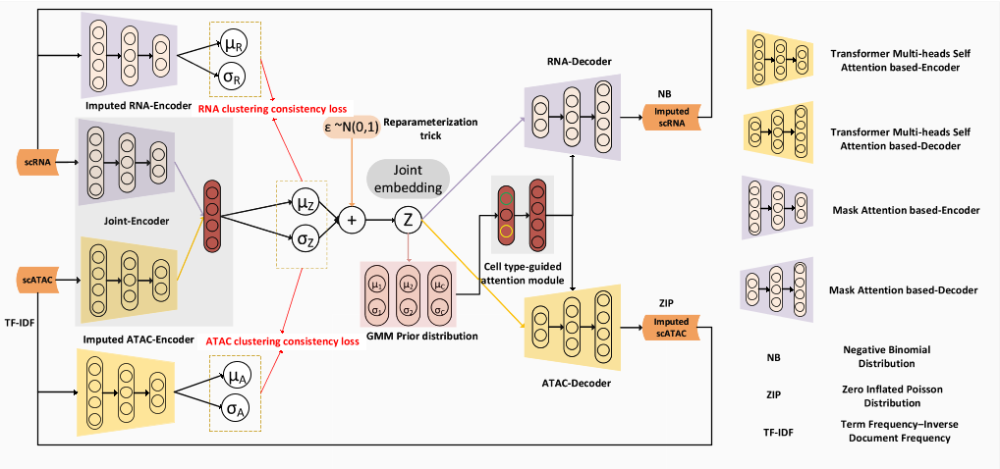
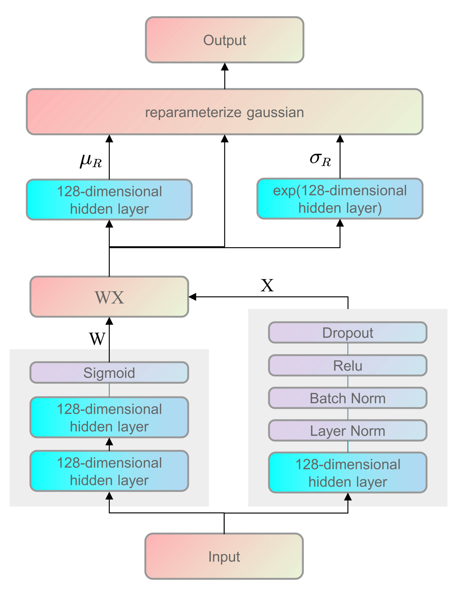
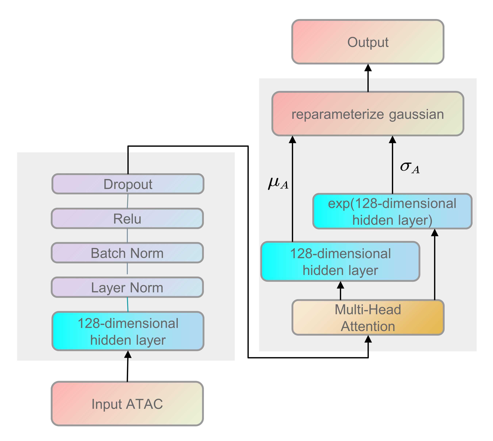

# Implementing scMVP

[TOC]

<div style="page-break-after:always;"></div>

## 1 Create and manage a virtualenv

Pipenv is a Python virtualenv management tool that supports many systems and nicely bridges the gaps between pip, python (using system python, pyenv, or asdf), and virtualenv. Therefore, I decided to use `pipenv` to create and manage a virtualenv for my projects.

The packages that have been installed are as follows:

```bash
# CUDA 11.7
pipenv install torch==2.0.1 torchvision==0.15.2 torchaudio==2.0.2
pipenv install pandas
pipenv install scipy
pipenv install scikit-learn==0.22.2
pipenv install scanpy
pipenv install portalocker torchdata
pipenv install torchtext
```

**Configurate for jupyter**

```bash
pipenv install ipykernel
python -m ipykernel install --user --name=VirtualEnvironment --display-name VirtualEnvironment
```

## 2 Dataset

### 2.1 gene expression: count matrix(cells $\times$ genes)

In the count matrix, **the rows represent individual cells, while the columns represent different genes**. Each entry in the matrix represents the number of sequencing reads that align to a specific gene in a particular cell. The count matrix provides information about the expression levels of various genes across individual cells, allowing for the analysis of gene expression patterns, identification of cell types, and exploration of cellular heterogeneity within a population.

### 2.2 atac expression: peak matrix(cells $\times$ peaks)

In scATAC-seq data, a“peak” refers to a region of the genome that is predicted to represent a region of open chromatin. Each row of the matrix represents such a region. Each value in the matrix represents the number of Tn5 integration sites for each single barcode that maps within each peak. This is analogous to the gene expression count matrix used to analyze single-cell RNA-seq. However, instead of genes, each row of the matrix represents a region of the genome(a peak), that is predicted to represent a region of open chromatin.

### 2.3 Barcode

Barcodes play a crucial role in identifying the origin of sequencing reads. Barcodes are crucial for distinguishing the data from different cells when they are sequenced together in a single run.

- **Gene Barcode in scRNA-seq**: In scRNA-seq, a cell is broken open and the genetic information expressed inside is labeled with a molecular tag that serves as a barcode. This barcode is unique to each cell, allowing the origin of the RNA to be traced back to the individual cell it came from. This means that when several cells are sequenced at the same time, they can be tracked individually based on their unique barcodes. 

- **ATAC Barcode in scATAC-seq**: In scATAC-seq, each cell or nucleus is tagged at regions of open chromatin using a hyperactive Tn5 transposase in a bulk reaction⁶. Barcoding and amplification of tagged sites within individual droplets generate a library of fragments representative of the original open chromatin profile of each cell. Similar to scRNA-seq, each cell or nucleus receives a unique barcode, allowing the origin of the chromatin accessibility data to be traced back to the individual cell or nucleus it came from. 

### 2.4 gene name and atac name

In scRNA-seq and scATAC-seq, the terms "gene name" and "ATAC name" typically refer to the identifiers used for genes and genomic regions, respectively. 

- **Gene Name in scRNA-seq**: In scRNA-seq, each row in the count matrix corresponds to a gene. The gene identifier, such as an Ensembl ID or gene symbol, is usually used as the row name. These provide an unambiguous mapping between each row of the matrix and the corresponding gene. 

- **ATAC Name in scATAC-seq**: In scATAC-seq, each row in the count matrix corresponds to a genomic region, often referred to as a "peak", which represents a region of open chromatin that is accessible to the transposase used in the ATAC-seq experiment. 

These identifiers are crucial for distinguishing the data from different genes and genomic regions when they are sequenced together in a single run.

### 2.5 Peak

In scATAC-seq, a "peak" refers to a region of the genome that is accessible to the transposase used in the ATAC-seq experiment. These regions of open chromatin are often associated with active regulatory elements such as promoters and enhancers. 

### 2.6 sciCAR dataset

For the sci-CAR dataset, only co-assay cells were used for further analysis, and cells with fewer than 200 peaks or genes, and peaks or genes with fewer than 10 cells were removed from further analysis.

#### 2.6.1 sciCAR_cellline_rna_normalize_count.mtx

The `sciCAR_cellline_rna_normalize_count.mtx` file is a matrix file that contains normalized count data from a single-cell RNA sequencing (scRNA-seq) experiment. The rows and columns of this matrix typically represent genes and individual cells, respectively. 

- **Rows**: Each row in the matrix corresponds to a gene. The gene identifier is usually used as the row name. 

- **Columns**: Each column in the matrix corresponds to a single cell. The cell identifier is usually used as the column name. 
- **Value**: The value in each cell of the matrix represents the normalized count of transcripts(i. e., the expression level) of a particular gene in a particular cell. 

#### 2.6.2 sciCAR_cellline_atac_normalize_count.mtx

The `sciCAR_cellline_atac_normalize_count.mtx` file is a matrix file that contains normalized count data from a single-cell Assay for Transposase-Accessible Chromatin using sequencing (scATAC-seq) experiment. The rows and columns of this matrix typically represent genomic regions(peaks) and individual cells, respectively. 

- **Rows**: Each row in the matrix corresponds to a genomic region, often referred to as a“peak”, which represents a region of open chromatin that is accessible to the transposase used in the ATAC-seq experiment. 

- **Columns**: Each column in the matrix corresponds to a single cell. The cell identifier is usually used as the column name. 

- **Value**: The value in each cell of the matrix represents the normalized count of transposase-accessible sites of a particular genomic region in a particular cell.

### 2.7 Paired-seq dataset

For Paired-seq dataset, cells with fewer than 200 peaks or genes, and peaks or genes with fewer than 10 cells or peaks with more than 336 cells were removed from further analysis.

### 2.8 SNARE-seq dataset

For SNARE-seq dataset, cells with fewer than 200 peaks or genes and peaks or genes with fewer than 10 cells were removed from further analysis.

## 3 The Model

scMVP consists of a two-channel encoder network and a two-channel decoder to integrate the information from scRNA-seq and scATAC-seq, and the input dimension of each channel is determined by the gene and peak number.



1. Two independent channels of attention-based networks are utilized to the backbone of the encoder model to adapt inputs of the different modalities, including canonical mask attention subnetwork for scRNA and transformer derived self-attention for TF-IDF transformed scATAC, and then joint together to **derive the posterior distribution parameters of common latent embedding z following Gaussian mixture model prior**.
   $$
   z = \mu_z+\sigma_zI, \ I \thicksim N(0,1) 
   $$

2. The imputed scRNA and scATAC profiles are reconstructed by an attention based two-channels decoder network, which shares a similar network structure with the encoder network.

3. An auxiliary attention module with input of cluster probability of common latent embedding z (denoted as $p(c| z))$ in the prior distribution is utilized to **weight each decoder channel of the imputed scRNA and scATAC profile**.

4. The imputed RNA and ATAC are produced by the mean value of Gamma distribution for scRNA data and the Poisson distribution for scATAC data, respectively.

5. To **guarantee the embedding consistency between the original and imputed data**, two single-channel encoders are used to embed the imputed RNA and ATAC separately to minimize the KL divergence between common latent embedding z and each imputed embedding.

### 3.1 RNA encoder

RNA branch of the encoder sequentially concatenates a 128-dimensional hidden layer, a layer normalization layer, a batch normalization layer, and an output Relu activation layer, which is weighted by a mask attention tensor generated from the first 128-dimensional hidden layer.




```python
# Parameters for latent distribution
q = self.encoder(x, *cat_list) * self.px_decoder_aux(x)
q_m = self.mean_encoder(q)
q_v = torch.exp(self.var_encoder(q)) + 1e-4
latent = reparameterize_gaussian(q_m, q_v)
return q_m, q_v, latent
```

### 3.2 ATAC encoder

The ATAC branch of the encoder sequentially concatenates a 128-dimensional hidden layer, a batch normalization layer, a Relu activation layer, and a multi-heads self-attention layer, which is designed as 8 self-attention heads and each head takes a 16-dimension feature in this study, and a layer normalization.



```python
# Parameters for latent distribution
q = self.encoder(x, *cat_list)
assert q.shape[1] % self.n_heads == 0, "n_heads cann't be divided by seq length!"
Q = self.w_q(q).view(q.shape[0], self.n_heads, q.shape[1] // self.n_heads, -1)
K = self.w_k(q).view(q.shape[0], self.n_heads, q.shape[1] // self.n_heads, -1)
V = self.w_v(q).view(q.shape[0], self.n_heads, q.shape[1] // self.n_heads, -1)
energy = torch.matmul(Q, K.permute(0, 1, 3, 2))
attention = self.do(torch.softmax(energy, dim=-1))
q_a = torch.matmul(attention, V).view(q.shape[0], q.shape[1])

q_m = self.mean_encoder(q_a)
q_v = torch.exp(self.var_encoder(q_a)) + 1e-4
latent = reparameterize_gaussian(q_m, q_v)
return q_m, q_v, latent
```

### 3.3 A two-channel encoder

scMVP uses a **mask attention channel** for the RNA branch and a **self-attention channel** for the ATAC branch to identify the cell type-associated information and capture the intra-omics distal correlation. The output two channels are combined together to form a shared linear layer (256 dimensions).

### 3.4 The attention module

The attention module receives the $p(c|z)$ for all K components as input, by a linear layer (128 dimensions), and then weights the last layer of each decoder channel with a SoftMax activation function.

### 3.5 A two-channel decoder

A two-channel decoder is employed to determine the distribution parameters of NB and ZIP for the reconstruction of scRNA-seq and scATAC-seq, which utilize a similar network structure with the network except for **an attention module**.

$$
p(c)=Cat(\pi)=\prod_{k=1}^K{\pi _k^{c_k}}, \ \pi = [\pi_1,\pi_2,...,\pi_K]
$$

$$
p(z|c)=N(z|\mu_c,\sigma_cI)=\frac{1}{\sqrt{2\pi}\sigma}e^{(-\frac{(z-\mu_c)^2}{2\sigma^2_c})}
$$

Here, $c$ represents one of the $K$ components(clusters) of Gaussian mixture distribution, which is extracted from a categorical distribution with probability $\pi_c$, then the common embedding latent variable $z$ is derived from the component $c$ with a probability $p(z|c)=N(z|\mu_c,\sigma_cI)$, which means the latent variable $z$ associated cells belongs to a specific cluster (cell type) $c$.

#### 3.5.1 RNA decoder


$$
\alpha_x,\beta_x=Decoder_x(z)
$$

$$
p\left(\mu_x \mid \alpha_x, \beta_x\right)=Gamma\left(\alpha_x, \beta_x\right)=\frac{\beta_x^{\alpha_x} \bar{x}^{\alpha_x-1} e^{-\beta_x \bar{x}}}{\Gamma\left(\alpha_x\right)}
$$

$$
p\left(\mathrm{x} \mid \mu_x\right)=Poisson\left(\mu_x\right)=\frac{\mu_x^{\mathrm{x}}}{\mathrm{x} !} e^{-\mu_x}
$$

Then, a two-channel decode network is used to generate the parameters of the NB and ZIP distribution to reconstruct the original observed $x$ (RNA) and TF-IDF transformed $y$ (ATAC) from the common latent variable $z$. As a result, the RNA counts can be imputed with the mean of the Poisson distribution.

#### 3.5.2 ATAC decoder

$$
\mu_y, \tau_y=Decoder_y(z)
$$

$$
p\left(\bar{y} \mid \mu_y\right)={Poisson}\left(\mu_y\right)=\frac{\mu_y^{\bar{y}}}{\bar{y} !} e^{-\mu_y}
$$

$$
\mathrm{p}\left(\omega_y \mid \tau_y\right)={Bernoulli}\left(\tau_y\right)=\tau_y{ }^{\omega_y}\left(1-\tau_y\right)^{1-\omega_y}
$$

$$
\begin{equation}
	\begin{aligned}
	\mathrm{p}(\mathrm{y} \mid \bar{y}, \omega_y) =&\ \left[p\left(\bar{y} \mid \mu_y\right) * \mathrm{p}\left(\omega_y=1 \mid \tau_y\right)\right]_{y>0}  \\
	& +\left[\mathrm{p}\left(\omega_y=0 \mid \tau_y\right)+p\left(\bar{y} \mid \mu_y\right) * \mathrm{p}\left(\omega_y=1 \mid \tau_y\right)\right]_{y=0}
	\end{aligned}
\end{equation}
$$

Similarly, the ZIP distribution is decomposed as a Poisson distribution and a Bernoulli distribution, and the mean $μ_y$ of the Poisson distribution is worked here as the imputation of scATAC-seq data

### 3.6 cycle-GAN

To further improve the performance of the scMVP model to extreme sparse dataset as joint profiling dataset, a **cycle-GAN** like clustering consistency auxiliary network to coordinate the latent embedding of each scMVP imputed profile with the joint embedding from the raw profile, was introduced.

Duo to the different characteristics of scRNA data and scATAC data, 

### 3.7 The optimizer

scMVP model is optimized by maximizing the log likelihood probability of the generated scRNA and ATAC data according to variational Bayesian inference:


