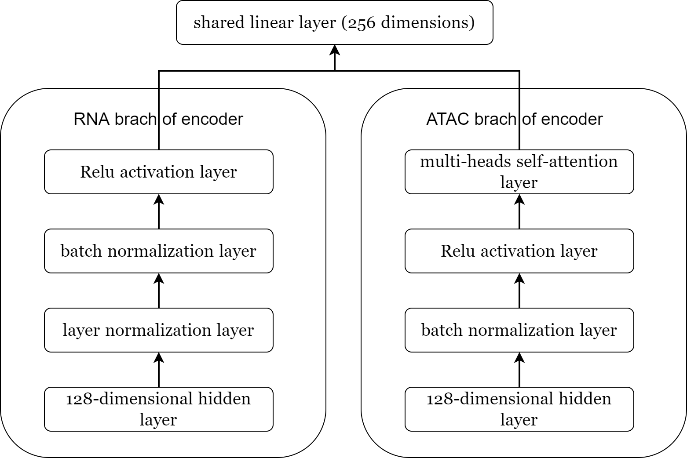
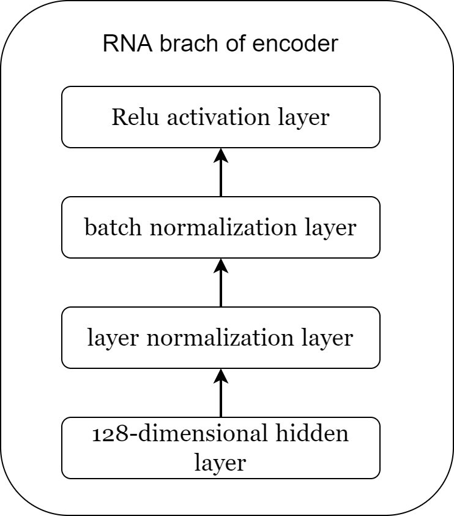
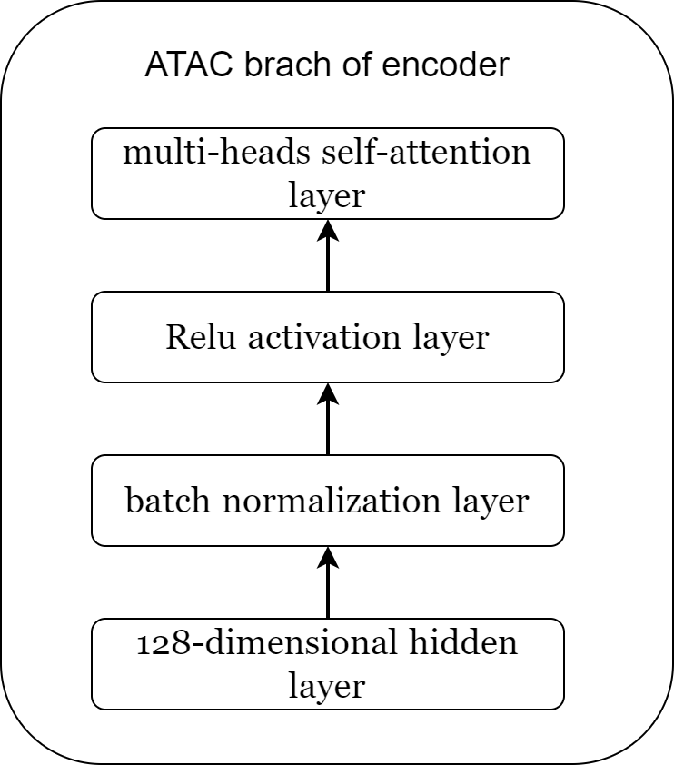
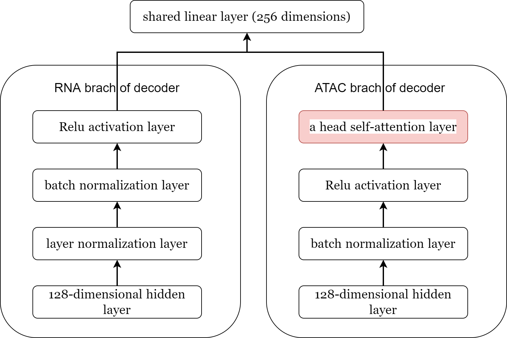

# Implementing scMVP

## 1 Create and manage a virtualenv

Pipenv is a Python virtualenv management tool that supports many systems and nicely bridges the gaps between pip, python (using system python, pyenv, or asdf), and virtualenv. Therefore, I decided to use `pipenv` to create and manage a virtualenv for my projects.

The packages that have been installed are as follows:

```bash
# CUDA 11.7
pipenv install torch==2.0.1 torchvision==0.15.2 torchaudio==2.0.2
pipenv install pandas
pipenv install scipy
pipenv install scikit-learn==0.22.2
pipenv install scanpy
```

## 2 Dataset

### 2.1 sciCAR dataset

For the sci-CAR dataset, only co-assay cells were used for further analysis, and cells with fewer than 200 peaks or genes and peaks or genes with fewer than 10 cells were removed from further analysis.

### 2.2 Paired-seq dataset

For Paired-seq dataset, cells with fewer than 200 peaks or genes, peaks, or genes with fewer than 10 cells or peaks with more than 336 cells were removed from further analysis.

### 2.3 SNARE-seq dataset

For SNARE-seq dataset, cells with fewer than 200 peaks or genes and peaks or genes with fewer than 10 cells were removed from further analysis.

## 3 The Model

scMVP consists of a two-channel encoder network and a two-channel decoder to integrate the information from scRNA-seq and scATAC-seq, and the input dimension of each channel is determined by the gene and peak number.

### 3.1 A two-channel encoder

scMVP uses a **mask attention channel** for the RNA branch and a **self-attention channel** for the ATAC branch to identify the cell type-associated information and capture the intra-omics distal correlation. The output two channels are combined together to form a shared linear layer (256 dimensions).



#### 3.1.1 The RNA branch of encoder

RNA branch of the encoder sequentially concatenates a 128-dimensional hidden layer, a layer normalization layer, a batch normalization layer, and an output Relu activation layer, which is weighted by a mask attention tensor generated from the first 128-dimensional hidden layer.



#### 3.1.2 The ATAC branch of encoder

The ATAC branch of encoder sequentially concatenates a 128-dimensional hidden layer, a batch normalization layer, a Relu activation layer, and a multi-heads self-attention layer, which is designed as 8 self-attention heads and each head takes 16-dimension feature in this study, and a layer normalization.



### 3.2 A two-channel decoder

A two-channel decoder is employed to determine the distribution parameters of NB and ZIP for the reconstruction of scRNA-seq and scATAC-seq, which utilize a similar network structure with the network except for **an attention module**.

