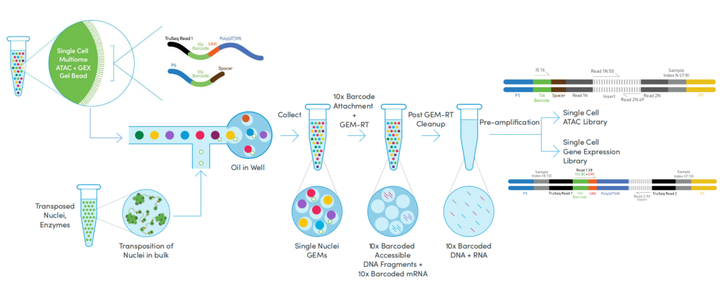

# 测序技术

在过去约 2 年中开发了几种方法，可以同时测量单细胞中的 DNA 可及性和基因表达。对我来说，这些联合检测方法是单细胞生物学中最令人兴奋的前沿之一，并将开辟一系列研究基因调控的新方法。

这些新的单细胞共检测方法包括 sciCAR、scCAT-seq、SNARE-seq、Paired-seq、ASTAR-seq、SHARE-seq，以及 10x Genomics 最近发布的商业解决方案。

## 1 10x Genomics

单细胞多组学ATAC+基因表达是10x Genomics推出的首个单细胞多组学解决方案，可以同时获得同一细胞的**基因表达和染色质可及性图谱**，从而更好地分辨终末分化细胞和发育轨迹上的细胞类型，揭示调控元件、开放染色质和基因表达之间复杂的相互作用。

### 1.1 10x Genomics单细胞多组学ATAC+基因表达技术原理

为同时获得同一细胞的转录组和表观组，10x Genomics单细胞多组学ATAC+基因表达技术首先利用Tn5转座酶对细胞核悬液进行核DNA转座，Tn5转座酶优先切割开放染色质区域中的核DNA。然后利用Chromium平台进行单细胞基因表达（GEX）和ATAC文库制备，该过程将单个细胞核、反应试剂与单个凝胶珠（Gel Bead）包裹成液滴（GEM）。凝胶珠同时包括带有特异性条形码（10x Barcode）、唯一分子标识符（UMI）的poly(dT)序列和带有10x Barcode的Spacer序列，poly(dT)序列能够捕获具有poly(dA)尾的mRNA用于生成基因表达（GEX）文库，Spacer序列能够将条形码添加到转座的DNA片段上生成ATAC文库。对得到的两种文库进行测序，并将来自同一细胞两种文库的测序数据通过10x Barcode匹配，即可实现同时对同一细胞的转录组和表观组进行关联。

    图1 10x Genomics单细胞多组学ATAC+基因表达技术原理

### 1.2 10x Genomics单细胞多组学ATAC+基因表达技术优势

**1.一个细胞，两种解读**

10x Genomics单细胞多组学ATAC+基因表达技术可以充分利用样品，从一个细胞中得到转录组和表观组两种信息，可以最大限度地获取有限样品的多层见解。

美国斯坦福大学医学院利用10x Genomics单细胞多组学ATAC+基因表达技术从来自同一患者的结直肠癌细胞系COLO320-DM（癌基因*MYC*在ecDNA上扩增）和COLO320-HSR（癌基因*MYC*在串联染色体扩增子（HSRs）上扩增）的总共72,049个细胞中获得了配对的转录组和染色质可及性图谱。单细胞ATAC-seq和单细胞RNA-seq数据的细胞聚类显示了COLO320-DM和COLO320-HSR细胞系的独立聚类。相对于染色体HSR *MYC*扩增的COLO320-HSR，在ecDNA *MYC*扩增的COLO320-DM中RNA表达以及*MYC*的可及性评分是高度异质性的，表明调控元件的可变活性可以解释细胞间致癌基因表达的差异。

**2.两种聚类结果结合更精细鉴定细胞类型**

10x Genomics单细胞多组学ATAC+基因表达技术能够同时利用转录组和表观组两套数据数据进行细胞聚类，更好的表征复杂细胞群的细胞异质性，发现隐藏的见解。此外，利用基因表达标记能够更容易地解释表观遗传特征。

麻省理工学院和哈佛大学布罗德研究所的研究人员利用单细胞多组学ATAC+基因表达技术获得了来自成年小鼠皮肤34,774个细胞的高质量表观基因组和转录组图谱，基于这两种数据的分析发现，不仅可以区分不同谱系的细胞类型，还可以区分密切相关类型的细胞，例如αhigh CD 34+与αlow CD 34+。基于RNA的的细胞簇也可以通过染色质可及性特征来区分，进一步确认它们的身份，例如根据谱系决定因子的活性对聚类进行了注释揭示了全转录激活因子Dlx3和Sox9以及阻遏物Zeb1和Sox5等。一些细胞状态可以通过染色质或基因表达特征以更高的分辨率识别，例如根据聚类特征对细胞簇进行分组揭示了毛囊永久部分和再生部分之间更明显的染色质可及性差异；相反对应颗粒层的细胞在基因表达水平上作为一个独特的簇更容易区分。

**3.转录组和表观组关联发现新的基因调控作用**

10x Genomics单细胞多组学ATAC+基因表达技术能够将调控元件与基因表达结合起来，探索驱动细胞分化，发育和疾病的基因调控相互作用。

华盛顿大学的研究人员将单细胞多组学ATAC+基因表达技术应用于8周龄雄性小鼠的肾脏组织，获得了11,296个细胞的转录组和染色质可及性图谱，并发现了1260个远端位点与321个基因的关联。44%的位点关联到最近的TSS，21%则关联到第二近的TSS。相关性最高的关联在远曲小管细胞标记基因Slc12a3和其TSS下游36 kb的位点之间，并与其最后一个外显子重叠，该位点的可及性对远曲小管细胞的特异性稍高。远端顺式调控元件和它们的靶基因之间的联系对于解释不同细胞类型的差异表达是有用的。例如，Slc6a 18（2型近端小管S3细胞的标志基因）的细胞类型特异性表达并不通过细胞类型特异性启动子可及性来反映，它的TSS与16 kb以外的一个位点相关，该位点的可及性与Slc6a18表达相关。

### 1.3 10x Genomics单细胞多组学ATAC+基因表达应用领域

由于单一组学的局限性，单细胞ATAC-seq测序技术出现之后不久，单细胞ATAC-seq与单细胞RNA-seq两种技术同时应用的策略便被采用。目前，这种策略已经已被大量应用于器官发育、疾病和癌症发生机制研究等不同领域，累计发表文章将近50篇。而直接利用单细胞多组学ATAC+基因表达技术进行同一细胞转录组和表观组的方法也已被应用于新生和成年小鼠大脑皮层、塞米松治疗的肺癌细胞、小鼠肾脏、小鼠胚胎发育阶段的前脑和小鼠皮肤等组织。2020年12月，首个利用10x Genomics单细胞ATAC+基因表达技术研究ecDNA中枢驱动分子间协同癌基因表达的研究也被报道。

## 3 References

[1] [10x Genomics单细胞多组学ATAC+基因表达原理与应用](https://zhuanlan.zhihu.com/p/377044315)

[2] [单细胞多组学测序技术汇总](https://www.jianshu.com/p/c4a48a146b75)